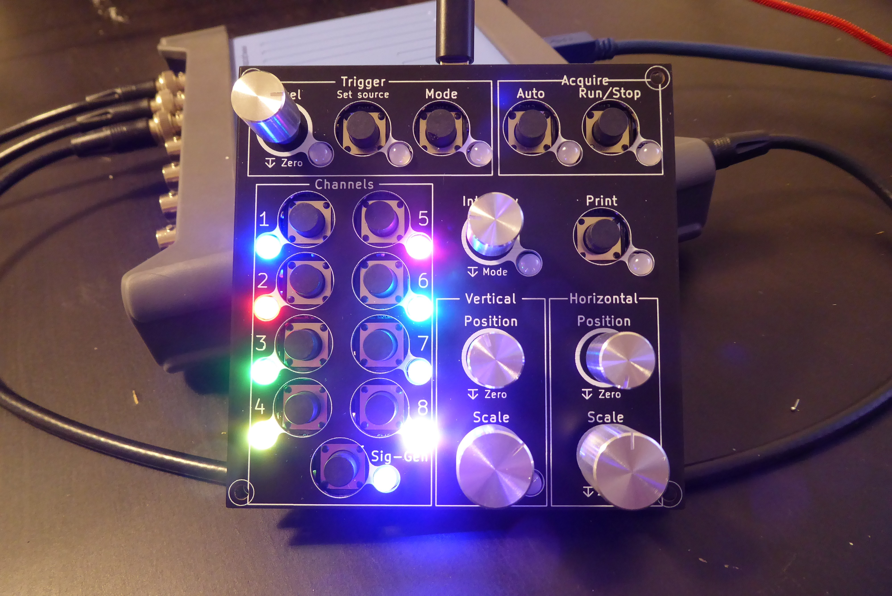

# ScopeKeypad
This project is to create a keypad for use with a PicoScope. The idea is to have a traditional interface to use with oscilloscope software.

https://youtu.be/zDIKAT928zg

To use:
Make circuit
	- get the 'main_pcb' made. (in the Hardware/gerbers folder)
	- get one of the 'front_panels' made. There is one for 7mm buttons, and one for 12mm buttons.
	- Solder all the components on
	- Solder JP1 and JP2 depending on if you brought Sparkfun or Worldsemi LEDs (they have different pinouts -_- ).
upload firmware
	- Install Arduino_STM32 ( https://github.com/rogerclarkmelbourne/Arduino_STM32 )
	- Open ScopeKeypad\Firmware\ScopeKeypad_Firmware\ScopeKeypad_Firmware.ino
	- Upload firmware with settings:
		- Board: "Generic STM32F103C"
		- Variant: "STM32F103C8 (20k RAM, 65k Flash)"
		- Upload method: "STLink"
		- CPU Speed(MHz): "72Mhz (normal)"
		- Optimize: "Smallest (default)"
upload shortcut settings to PicoScope software
	- Open PicoScope
	- Click 'Tools'
	- Click 'Preferences...'
	- Open the 'Keyboard' tab
	- Under 'Select keyboard map.', select 'import'
	- Open 'picoscope_shortcuts.pskeys'

